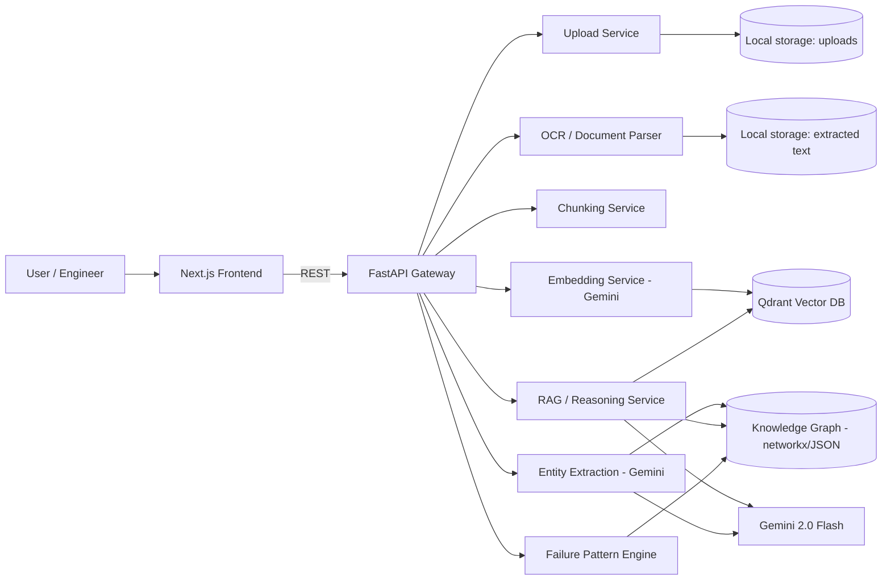
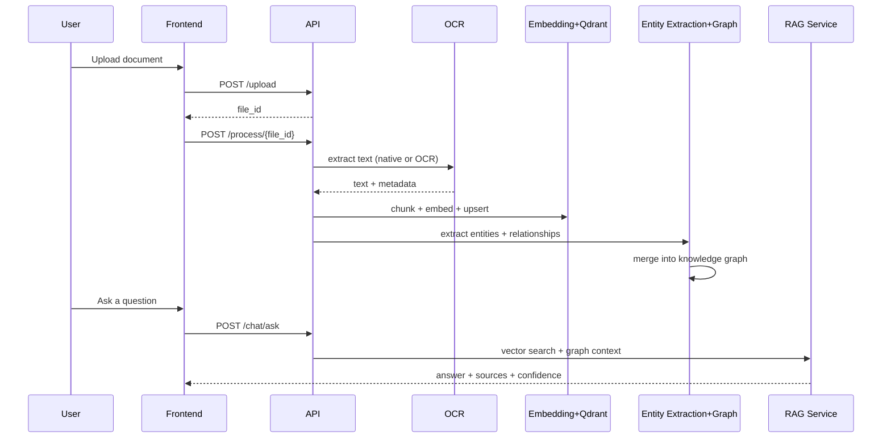

# Axon - Industrial Knowledge Intelligence

**Team Synapse** — Arsh Tiwari & Priyanshi Bothra
**ET AI Hackathon 2.0** — The Economic Times

> Turns scattered industrial documents into a connected, queryable operations brain.

---

## 1. The Problem

A large industrial plant typically runs on 7–12 disconnected document systems — P&IDs in one
place, maintenance work orders in another, SOPs in a third, inspection records in a fourth,
regulatory filings buried in email. Engineers spend a large share of their working hours just
searching for information that already exists somewhere in the organisation, and a big share of
unplanned downtime traces back to decisions made without full equipment history. Meanwhile,
a large fraction of India's most experienced industrial engineers will retire within the decade,
taking undocumented knowledge with them permanently.

This is not a file-storage problem. It's a safety, quality, and operational-efficiency problem
that compounds every year it goes unsolved.

## 2. The Idea, One Sentence

**Axon** ingests every industrial document a company has, builds a living knowledge graph out
of the equipment/people/failures/regulations mentioned inside them, and lets any engineer ask
a question in plain language and get a decision-ready, source-cited answer — instead of
searching through folders.

## 3. Why "Axon"

An axon is the fibre that carries a signal from one neuron to the next — it's the connective
tissue that turns isolated neurons into a network capable of thought. That's exactly what this
product does to a plant's documents: it doesn't just store them, it connects them so the
organisation's accumulated knowledge can actually be *reasoned over*.

---

## 4. What We Actually Built (and What We Didn't)

The original concept brainstorm sketched 10 features and 7 specialised agents. Building all of
that in a hackathon window and calling it "done" would mean a lot of half-working stubs. Instead
we scoped down to a smaller set that works end-to-end and is genuinely demoable:

**Implemented, working:**
| Component | What it does |
|---|---|
| Universal Document Ingestion | Upload PDF / DOCX / XLSX / images, OCR fallback for scanned pages |
| Semantic Search (RAG) | Chunking + Gemini embeddings + Qdrant vector search |
| Knowledge Graph Agent | LLM-based entity/relationship extraction → networkx graph, visualised in-browser |
| Industrial AI Copilot | Chat endpoint that fuses vector search + graph context into one grounded answer, with confidence + sources |
| **Failure Pattern Engine** (our differentiator) | Reads recurring `Equipment → Failure → Date` chains in the graph and predicts the next likely failure window — fully explainable, no black-box model |
| Executive Dashboard | Graph size, detected patterns, high-confidence predictions |

**Deliberately out of scope for this build** (roadmap, not implemented):
- Dedicated Compliance Agent mapping regulations (Factory Act / OISD / PESO) against procedures
- Dedicated Report Generator agent (PDF/weekly report export)
- Mobile-native app (the web UI is responsive but not a native mobile client)
- Authentication / multi-tenant access control
- Neo4j (see §7 for why, and the migration path)

We'd rather ship four things that actually work than seven that are half-mocked.

---

## 5. Architecture



### Data flow, upload to answer



---

## 6. Tech Stack & Why

| Layer | Choice | Why |
|---|---|---|
| Frontend | Next.js 14 + TypeScript + Tailwind | Fast to build a clean, responsive UI; App Router keeps routing simple |
| Backend | FastAPI (Python) | Async, typed, and every document/AI library we need is Python-first |
| LLM + Embeddings | Gemini 2.0 Flash + text-embedding-004 | Strong price/performance for a hackathon budget, native multimodal OCR fallback path |
| Vector DB | Qdrant | Open-source, single Docker container, fast filtered search by `file_id` |
| Knowledge Graph | networkx + JSON on disk | See below |
| OCR | PyMuPDF native text, Tesseract fallback for scanned pages | Avoids paying for OCR on documents that already have a text layer |

**Why networkx instead of Neo4j for the graph store:** the original plan called for Neo4j. For
an MVP judged on a working prototype, running a graph database is one more moving part that can
fail during a live demo for no reason related to the actual idea. `networkx` gives us the exact
same node/relationship model in memory, persisted as a JSON file, with zero extra infrastructure.
The graph service (`graph_service.py`) is written so a Neo4j-backed version is a drop-in
replacement — same function signatures, same JSON-serialisable shape — when the system needs to
scale past what fits in memory. That migration path is a scalability decision, not a rewrite.

---

## 7. Scalability Path

- **Vector search** — Qdrant already supports sharding and horizontal scale-out; no code change needed, only infra config.
- **Knowledge graph** — swap `graph_service.py`'s networkx backend for Neo4j once the graph exceeds what comfortably fits in memory (roughly hundreds of thousands of nodes). The API surface (`add_extraction`, `get_subgraph`, `search_nodes`) stays identical, so nothing upstream changes.
- **Document processing** — OCR/extraction/embedding are already isolated, stateless functions; they can move behind a task queue (Celery/RQ) for batch ingestion of thousands of documents without touching the API layer.
- **Multi-plant deployment** — `file_id` and graph nodes already carry `sources`/`file_id` metadata, which is the seam needed to add tenant/plant scoping later.

## 8. Business Impact

- Cuts the search-and-clarify time engineers currently lose chasing information across 7–12 disconnected systems.
- Converts undocumented tribal knowledge from retiring engineers into a permanent, queryable asset before it's lost.
- Turns inspection/maintenance history that already exists into early warnings — the Failure Pattern Engine surfaces a predicted failure window from data the plant already has, no new sensors required.
- Every answer is source-cited, which matters for audit and safety review — nothing is a black box.

## 9. USPs

1. **Living knowledge graph, not just a vector index** — the system understands that Pump A is installed in Boiler 4, was inspected by Ravi, and failed the same way twice, not just that some text chunks are similar.
2. **Explainable predictive maintenance** — the Failure Pattern Engine's predictions are a direct, human-readable read of the graph (interval math on real failure dates), not an opaque model score.
3. **Grounded answers with confidence + citations** — every Copilot answer names the source documents and a confidence level, so an engineer knows how much to trust it.
4. **Organisational memory that outlives any one engineer** — every document processed adds permanently to the graph; nothing is lost when someone retires.
5. **Cross-functional by design** — one graph serves maintenance, quality, safety, and compliance questions instead of four separate tools.


---

## 10. Project Structure

```
Axon-AI/
├── backend/
│   ├── app/
│   │   ├── main.py                # FastAPI app + router registration
│   │   ├── routers/                # upload, process, embed, graph, chat, insights
│   │   └── services/                # ocr, chunking, embedding, vector store,
│   │                                 entity extraction, graph, RAG, pattern engine, llm
│   ├── storage/                    # uploads / extracted text / graph.json (gitignored)
│   ├── requirements.txt
│   ├── docker-compose.yml          # Qdrant
│   └── .env.example
└── frontend/
    ├── app/                        # /, /chat, /graph, /dashboard
    ├── components/                 # upload, chat, graph, ui
    ├── lib/                        # api.ts client, utils
    └── package.json
```

## 11. Installation & Running Locally

### Prerequisites
- Python 3.11+
- Node.js 18+
- Docker (for Qdrant)
- A Gemini API key from Google AI Studio

### Backend

```bash
cd backend
python3 -m venv myenv
source myenv/bin/activate        # Windows: myenv\Scripts\activate
pip install -r requirements.txt

cp .env.example .env             # then add your GEMINI_API_KEY

docker compose up -d             # starts Qdrant on localhost:6333

uvicorn app.main:app --reload --port 8000
```

Backend is now live at `http://localhost:8000` (docs at `/docs`).

### Frontend

```bash
cd frontend
npm install
cp .env.local.example .env.local
npm run dev
```

Frontend is now live at `http://localhost:3000`.

### Demo flow
1. Go to `http://localhost:3000`, upload a few sample maintenance/inspection PDFs.
2. Click **Process** on each — this OCRs, embeds, and builds the knowledge graph automatically.
3. Go to **Ask Axon** and ask something like *"Has this compressor failed before?"*
4. Go to **Knowledge Graph** to see the extracted entities connected visually.
5. Go to **Dashboard** to see any predicted failure patterns once you've uploaded documents with repeated dated failures for the same equipment.

## 12. API Reference

| Method | Path | Purpose |
|---|---|---|
| POST | `/upload/` | Upload a document |
| POST | `/process/{file_id}` | OCR / extract text |
| POST | `/embed/{file_id}` | Chunk + embed + store in Qdrant |
| GET | `/embed/search?query=` | Raw vector search |
| POST | `/graph/extract/{file_id}` | Extract entities/relationships into the graph |
| GET | `/graph/full` | Full graph, for visualization |
| GET | `/graph/node/{name}` | Neighbourhood of one entity |
| POST | `/chat/ask` | Ask a grounded question (RAG + graph) |
| GET | `/insights/patterns` | Detected recurring failure patterns |
| GET | `/insights/stats` | Dashboard summary stats |

---

Built for ET AI Hackathon 2.0 by **Team Synapse** (Arsh Tiwari, Priyanshi Bothra).
